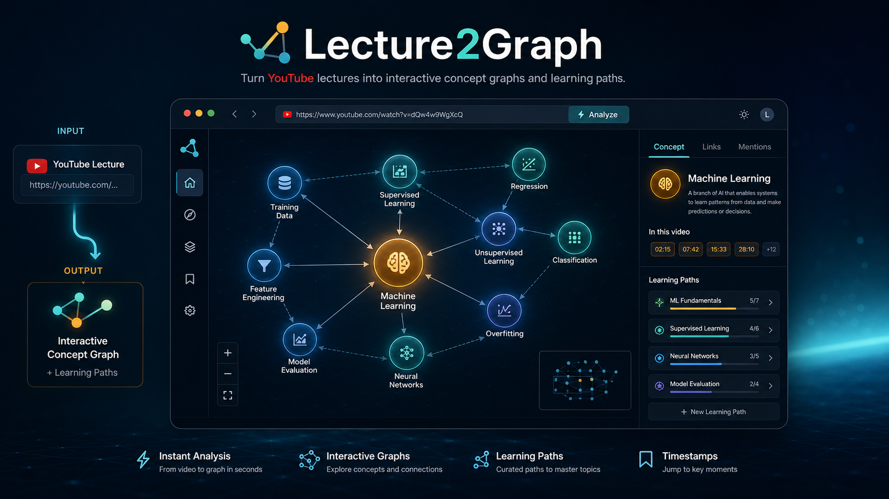

# Lecture2Graph

Turn lectures into interactive concept graphs and learning paths.



Lecture2Graph takes a YouTube lecture, extracts the core ideas, maps their prerequisites, and turns the result into a visual study graph you can explore in a single Streamlit app.

It is designed to feel like:

- a developer tool with a real CLI
- a student-facing learning product
- a visual AI system centered on graphs and learning order

## What it does

Paste a YouTube lecture and get:

- an interactive concept graph
- prerequisite links between ideas
- an ordered learning path
- original and translated transcript views
- timestamp links back into the source video
- exports as `graph.html`, `notes.md`, and `lecture2graph.json`

## Quick Start

### 1. System dependencies

Install these first:

- Python 3.10+
- `ffmpeg`
- `tesseract-ocr`

Node is no longer required.

### 2. Python setup

From the repo root:

```bash
python -m venv .venv
.venv\Scripts\activate
pip install -e .
```

Optional LLM engines:

```bash
pip install -e ".[llm]"
```

### 3. Run the Streamlit app

```bash
streamlit run streamlit_app.py
```

Then open the local URL Streamlit prints, usually:

```text
http://localhost:8501
```

### 4. Try a bundled demo instantly

The app ships with sample results for:

- `XRcC7bAtL3c` - tree traversal
- `N2P7w22tN9c` - BFS / DFS
- `Tp37HXfekNo` - DBMS keys
- `azXr6nTaD9M` - recursion and stack
- `eXWl-Uor75o` - sorting and merge sort

These load immediately from the sidebar.

## Real lecture processing

For a fresh lecture:

1. Launch Streamlit
2. Paste a YouTube URL
3. Choose an engine
4. Click `Generate graph`

Default engine:

- `rules` - local-first, no API key required

Optional engines:

- `groq`
- `gemini`
- `openai`

Provider keys can be passed in the UI or loaded from `.env`.

Example `.env`:

```env
GROQ_API_KEY=your_groq_api_key_here
GEMINI_API_KEY=your_gemini_api_key_here
OPENAI_API_KEY=your_openai_api_key_here
```

## CLI

The CLI still works:

```bash
lecture2graph "https://www.youtube.com/watch?v=VIDEO_ID"
```

Optional engines:

```bash
lecture2graph "https://www.youtube.com/watch?v=VIDEO_ID" --engine groq
lecture2graph "https://www.youtube.com/watch?v=VIDEO_ID" --engine gemini
lecture2graph "https://www.youtube.com/watch?v=VIDEO_ID" --engine openai
```

Output goes to:

```text
data/<video_id>/
```

including:

- `graph.html`
- `notes.md`
- `lecture2graph.json`

## Architecture

```text
streamlit_app.py             single-file web app
core/lecture2graph/          reusable pipeline, CLI, plugins, exports
data/                        bundled sample results + generated outputs
docs/                        screenshots and contributor docs
utils/                       small maintainer helpers
```

Core flow:

```text
YouTube URL
  -> ingest
  -> ASR + OCR
  -> normalize
  -> engine plugin
  -> result bundle
  -> graph / notes / exports
```

## Plugin system

Lecture2Graph supports:

### Domain plugins

Domain packs provide:

- regex concept patterns
- OCR keyword mappings
- prerequisite rules
- concept descriptions

Builtin packs currently cover:

- trees
- graphs
- databases
- sorting
- core CS concepts

### Engine plugins

Available engines:

- `rules`
- `groq`
- `gemini`
- `openai`

External plugins can be loaded through `LECTURE2GRAPH_PLUGIN_PATHS`.

## Repository status

This repo has been cleaned up around the product path:

- Streamlit app for the website
- reusable Python core
- CLI support
- bundled demo data

## Contributing

See [CONTRIBUTING.md](CONTRIBUTING.md).

Good starter tasks live in [docs/good-first-issues.md](docs/good-first-issues.md).

